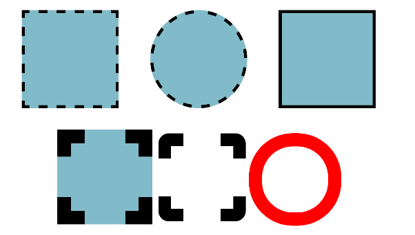
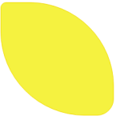

CHALLENGE
=========

 

We will continue working with the html page (box.html) created in the last
challenge. Add the border-radius property to your .box class. Change the border
style to “solid”.

~~~~~~~~~~~~~~~~~~~~~~~~~~~~~~~~~~~~~~~~~~~~~~~~~~~~~~~~~~~~~~~~~~~~~~~~~~~~~~~~
.box{
     border: 10px solid;
     border-radius: 30px;
}
~~~~~~~~~~~~~~~~~~~~~~~~~~~~~~~~~~~~~~~~~~~~~~~~~~~~~~~~~~~~~~~~~~~~~~~~~~~~~~~~

 

-   Add 2 more  boxes to your html in the form of \<div\> tags

-   Assign the *box* class  to each \<div\> 

-   Create an id css selector for each box (box1, box2, box3) and assign an id
    to each div so it is uniquely targetted

-   Add a border radius of 200px to the box2 id selector 

-   Add  a solid border style to box3 id selector.

-   Add similar values to the box1 id selector

-   Play with the boxes, changing their display as you wish. See below for some
    examples to get you started. Have Fun!

 

-   As an extra challenge, create a lemon shape using border and radius
    properties.

 

