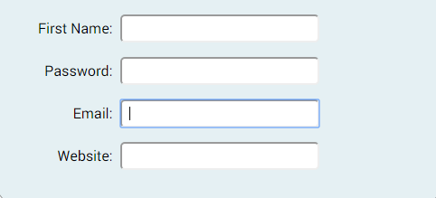

Challenge
=========

 

 

Open **form-template.html** (located in the lesson files folder). The file
contains some CSS to help with the form layout.

Add the following elements and attributes:

-   \<form\>

-   FirstName

-   Input type with a for email

-   Input type with a for website (URL)

-   Password

-   Submit button

 

NOTE:

We’ll add the styling to the form in a later lesson; but in the meantime, you
can go ahead and see if you can match the styling below!

 

 

**Note:** Your styling will be a little different from the above. But don’t
worry – we will fix this in the following challenge.
