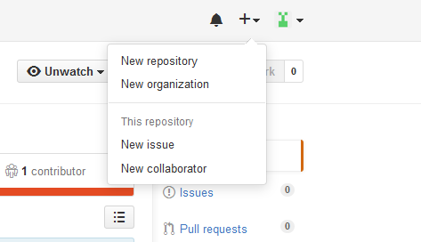
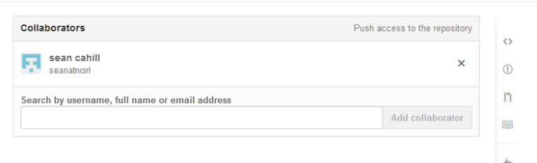

CHALLENGE
=========

 

**Challenge A:**

-   Follow the example at <https://help.github.com/articles/fork-a-repo/> under
    ‘forking an example repository’. Follow the instructions.

-   Now that we’ve forked the repo, we can clone it in our local environment.

-   Bring up a command tool or terminal. CD into a project folder and issue
    the **clone**command.

-   This will create a new folder for you. CD into this folder.

-   Make some change to the **index.html** file.

~~~~~~~~~~~~~~~~~~~~~~~~~~~~~~~~~~~~~~~~~~~~~~~~~~~~~~~~~~~~~~~~~~~~~~~~~~~~~~~~
>git add .
 
>git status
 
>git commit -m “Changed index file”
 
>git push -u origin master
~~~~~~~~~~~~~~~~~~~~~~~~~~~~~~~~~~~~~~~~~~~~~~~~~~~~~~~~~~~~~~~~~~~~~~~~~~~~~~~~

 

-   Review changes in GitHub.

  
  
**Challenge B:**

The first step is to add a collaborator to you project in GitHub. We are going
to buddy up for this session. Pair up with your nearest colleague or one of your
mentors.

In GitHub, navigate to your project and click on the ‘**+**’ button in the top
right.

 

-   Select **New collaborator** and add your buddy as a collaborator. Add their
    GitHub account to the collaborator input.

 

-   Now that you have added a collaborator, ask your colleague to clone the
    project you have set up in previous challenge, e.g. one of your projects
    you’ve pushed to GitHub. Give them the repo url (check notes above for clone
    command).

-   Give your colleague a short ‘spec’ of what you want to have changed in your
    project (it can be something small, such as adding a line of code).

-   Your colleague should create a new folder to work on your project.

-   Your colleague should make the change once they have cloned the project then
    add and commit changes and push to GitHub.

-   Once they are done, you will issue a pull request to see the changes they
    have made.

-   Issue the command **\>git diff HEAD** and **\>git diff HEAD\~1**

-   You will then see the changes that have been made.

-   Reverse this process so that you are now asked by your buddy to make a
    change.

-   When your colleague has committed, you can view commits in GitHub. Select
    the**commits** link in the top left.

