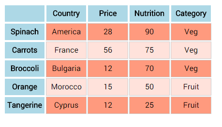

CHALLENGE
=========

 

-   Open the table.html file that you downloaded with the lesson files or
    download it
    from [here](https://drive.google.com/file/d/0B1Jzk3_OX0O8VXctRldYZktIWW8/view).

-   Complete the table and use jQuery to style it as below:

