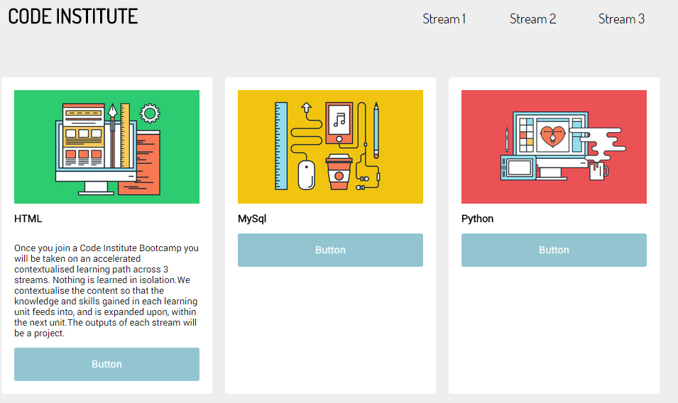
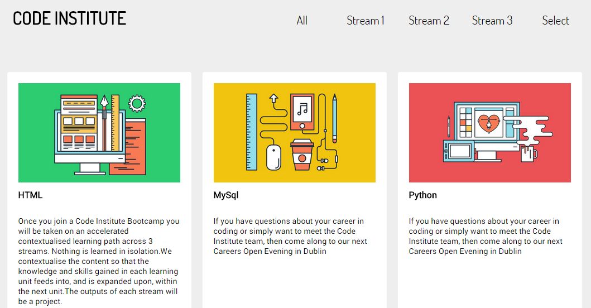

CHALLENGE
=========

 

Now with this knowledge of traversing the DOM, we can continue from the previous
lesson.

 

**Part 1:**  
Given the following HTML, what is the relationship between
the **button** and **p** elements?

Use that relationship to close the **p** element using **.slideToggle(‘slow’)**

~~~~~~~~~~~~~~~~~~~~~~~~~~~~~~~~~~~~~~~~~~~~~~~~~~~~~~~~~~~~~~~~~~~~~~~~~~~~~~~~
<!doctype html>
<html>
    <head>
        <meta charset="utf-8" />
        <meta name="viewport" content="width=device-width, initial-scale=1">
        <title>jQuery</title>
    </head>
    <body>
        

            

                <button id='button1'  class="bottom_button">Button 1</button>  
                
Once you join a Code Institute Bootcamp you will be taken on an accelerated contextualised learning path across 3 streams. Nothing is learned in isolation.We contextualise the content so that the knowledge and skills gained in each learning unit feeds into, and is expanded upon, within the next unit.The outputs of each stream will be a project. 

            

        
     
        
        
    </body>
</html>
~~~~~~~~~~~~~~~~~~~~~~~~~~~~~~~~~~~~~~~~~~~~~~~~~~~~~~~~~~~~~~~~~~~~~~~~~~~~~~~~

 

**Part 2:**  
Return to the cards page:

-   Give the paragraphs inside the cards a **display:none**

-   Use **slideDown** to display the card paragraphs when the **card\_image** is
    clicked.

 

**Part 3:**

-   When a card is clicked on, the background color is highlighted – e.g. set
    background-color to pink via adding a new class.

-   When the card is clicked again, it is unhighlighted (see **toggleClass**).

-    

**Part 4:**

-   Add two more nav elements to the nav bar, **select** and **all**.

 

-   When **select** is clicked, all panels disappear except those selected. This
    is a difficult challenge. Think about what is different about the
    highlighted panels. How could we select only those without the highlighting?

 

-   Clicking on **All** makes all panels reappear.

 

There is a lot going on here, but this combining of functions and selections is
what makes jQuery so powerful. Take your time to understand what’s happening
before moving on to the next section.  
  

