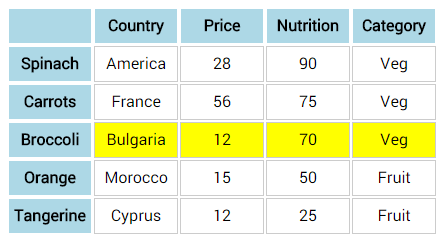

CHALLENGE
=========

 

Let’s practice some of the traversing methods.

Download Panel.zip from the lesson folder and extract locally. Open the folder
in sublime. Bring up button.html in a browser.

 

**Challenge A:** Write jQuery code to perform the following (add to style.js):

-   When a coloured panel is clicked, all panels vanish.

-   When a coloured panel is clicked, just that panel vanishes.

-   When a panel is clicked, all siblings fade to 10% opacity.

-   When reset is clicked, all panels revert to full opacity.

-   When the mouse hovers over a panel, that panel turns black (new CSS class
    would be helpful here ).

-   When the mouse moves away, the panel reverts back to its previous colour.

 

**Challenge B:** Return to the table challenge.

-   When a table header is clicked, the corresponding row should highlight.

 

-   When another table header (on the row) is clicked, the corresponding row
    should highlight and all others should turn white.

-   Add extra rows if you need to.

-   Traverse the DOM to find a solution.

 

**Challenge C:**

-   Change the text in the reset button to display the colour (RGB) of the
    selected panel.

