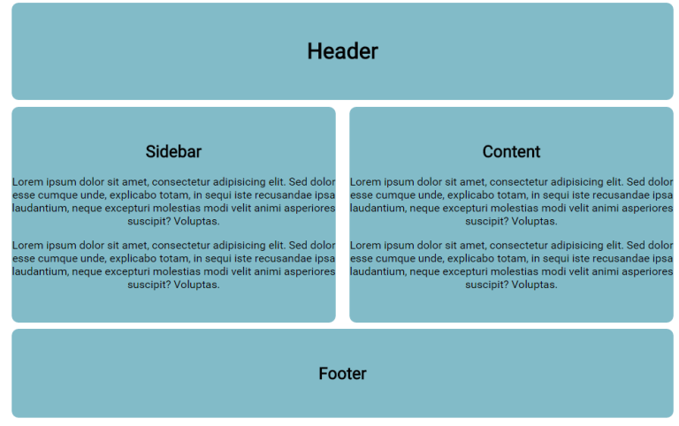

CHALLENGE
=========

 

-   Let’s continue with the code from the last lesson and apply `border-box:`

 

-   Add two paragraphs of placeholder text to the sidebar and content boxes:

 

Notice the lack of `padding` on the `left` and `right`.

-   Add `padding` of `40px` to the `left` and `right` of the sidebar using
    longhand notation.

-   Now you must recalculate the `width` for sidebar and content or use
    `border-box`.

-   Make the sidebar a `border-box` (see note on vendor prefixes).

-   Apply the same to the content `div`.

  
In Sublime Text when you type the word `lorem` in the the text editor and then
press the tab button, it will generate the `lorem ipsum` text. Otherwise you can
use a generator such as the one here at <http://www.lipsum.com/>.

 

-   Try adding a `border` to sidebar and content. `border-box` is very useful!
