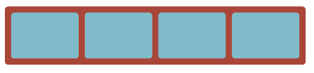
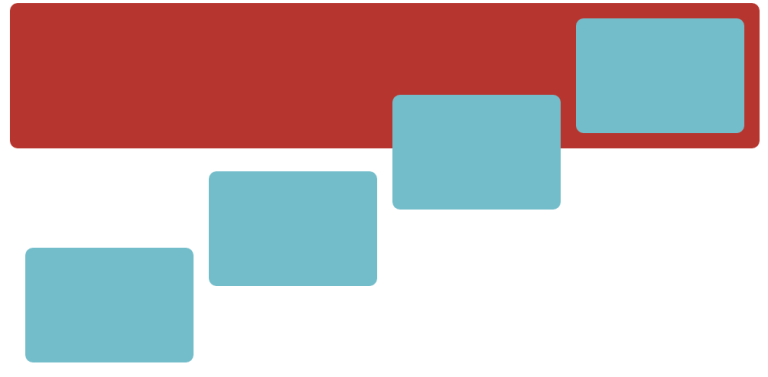
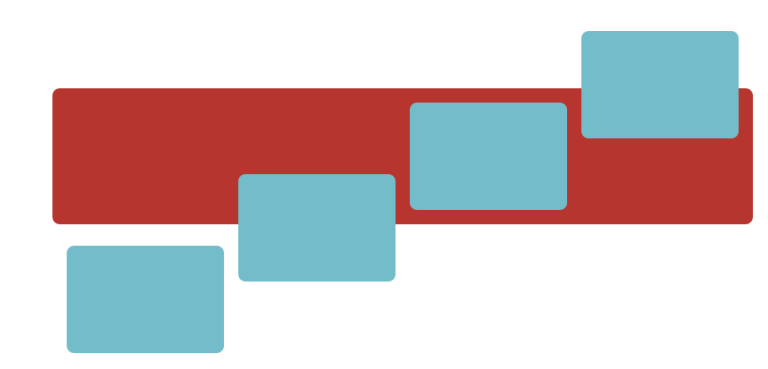
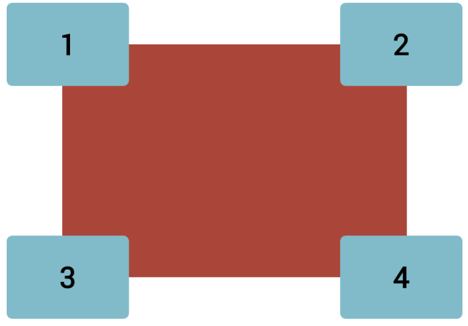
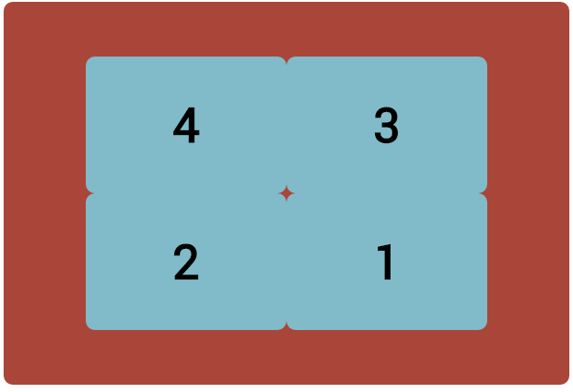
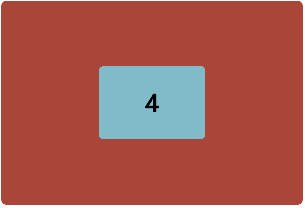

CHALLENGE
=========

 

Alter the code from the previous walk through:

Create the two layouts below. Hint: you might need to change the position of
container to achieve the second layout.

Resize the container to 600px x 400px:

Overlapping:

