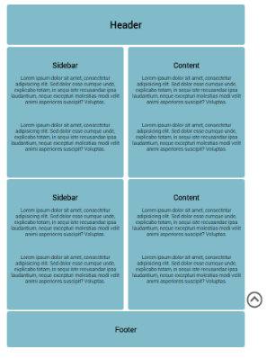

FIXED POSITIONING
=================

 

Let’s continue from the previous exercise and explore **fixed** positioning. We
will change the position of the header to fixed.

1.  First, we will setup the document. Create more content (another sidebar &
    content), otherwise it will be difficult to see the effect of the fixed
    positioning as we need some scrolling to take place.

 

1.  We need to tidy up our code a little here, we just copied and
    pasted **div**s which have **id**s. **Id** names must be unique or they will
    cause all sorts of problems down the line. Because there is now more that
    one sidebar and content, let’s make them **classes** rather than ids. That
    should solve the issue.

2.  Give the header border an **id** and change its position to **fixed**.

1.  This will cause some nasty layout problems! As the header is out of normal
    flow, the divs will move up covering it.

2.  We can push the divs down to make room. Add a **padding-top** to
    the **container** to give space to the header.

3.  There is one more issue. When we scroll, the content **div**s move on top of
    the header. We want the header on top.

1.  To do this we must change the **order** of the elements in the 3D space. We
    will not go into too much detail here but suffice is to say that
    the **z-index** controls that order.

1.  Let’s give the header a high **z-index**, e.g. 100.

~~~~~~~~~~~~~~~~~~~~~~~~~~~~~~~~~~~~~~~~~~~~~~~~~~~~~~~~~~~~~~~~~~~~~~~~~~~~~~~~
z-index: 100;
~~~~~~~~~~~~~~~~~~~~~~~~~~~~~~~~~~~~~~~~~~~~~~~~~~~~~~~~~~~~~~~~~~~~~~~~~~~~~~~~

1.  Save you work at this point. We will be continuing with this challenge in
    the next lesson.
