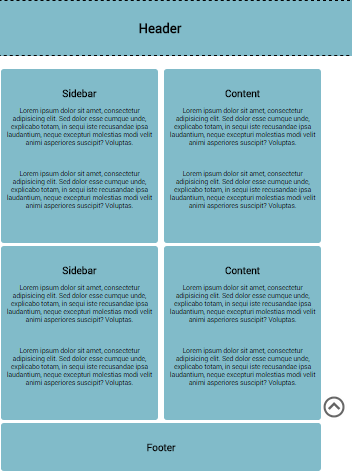
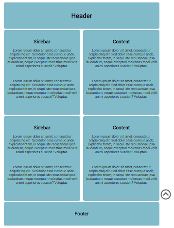

CHALLENGE
=========

 

**Adding a Background Image:**

Let’s return to the challenge of the previous lesson:

First, remove the following:

-   The code which fixes the heading to the top

-   The padding-top of the container

Add a background image to the body of your page using CSS:

~~~~~~~~~~~~~~~~~~~~~~~~~~~~~~~~~~~~~~~~~~~~~~~~~~~~~~~~~~~~~~~~~~~~~~~~~~~~~~~~
body{
/* background-image code here */
…
}
~~~~~~~~~~~~~~~~~~~~~~~~~~~~~~~~~~~~~~~~~~~~~~~~~~~~~~~~~~~~~~~~~~~~~~~~~~~~~~~~

Try both **cover** and **contain**.

Save your work, we will be returning to it in a future lesson.
