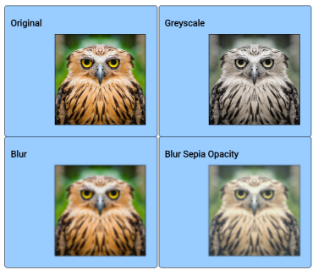

CHALLENGE
=========

 

**Adding Images:**

-   Return to your Challenge page with images.

-   Remove the paragraphs.

-   Replicate the divs so you have four images with 4 headings.

-   Choose just a single image.

Add a CSS filter to each. Choose from:

-   grayscale, blur, sepia, hue-rotate, saturate, opacity, brightness, or
    contrast

-   Add multiple filters to a single image

