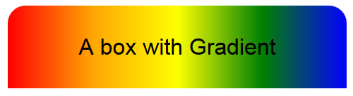

CHALLENGE
=========

 

Create a new HTML page (gradients.html).

Add several divs, be sure to give them a width and a height.

Try each of the above gradients, including:

-   Linear

-   Transparency

-   multiple stops

-   Radial  
    

Construct the following divs with Gradients:

*Radial with transparency and box-shadow.*

  
See how to generate a box shadow here:  
<http://www.w3schools.com/cssref/css3_pr_box-shadow.asp>
