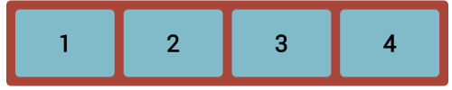
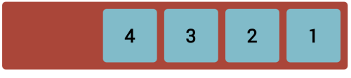
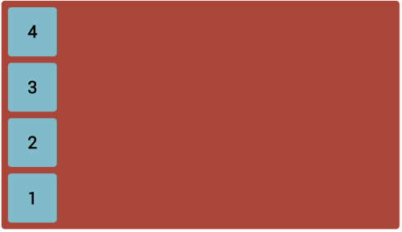
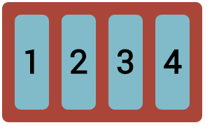
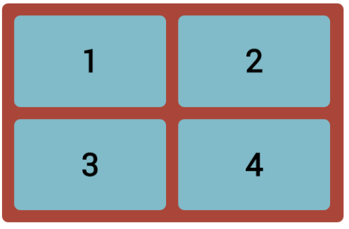
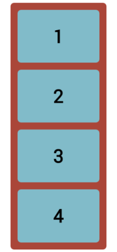

CHALLENGE
=========

 

For this challenge, download the **boxes.html** file in the lesson folder.
Numbers have been added for illustration.

 

1.  Make the container a flex container.

2.  Make the the container’s width 80%, so it will resize dynamically.

3.  Make the containers height 630px.

4.  Change the width of the box class to 150px.

5.  Change the margin of the box class to 5px.

 

Try to achieve the below layouts:

 

1.  Remove the height from the container class for the best results in the above
    challenge.

2.  Next, increase the width of the box class to 250px;

3.  Change the flex-direction to row (the default).

4.  Resize the browser and notice how the boxes react.

 

 

Try to achieve the below layouts (you will also need to resize the window to get
the exact layout):

 

