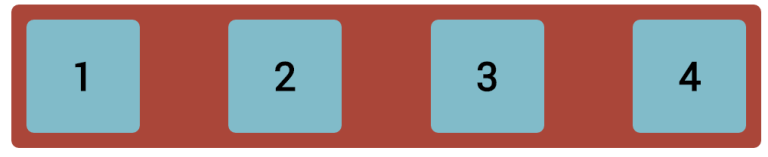
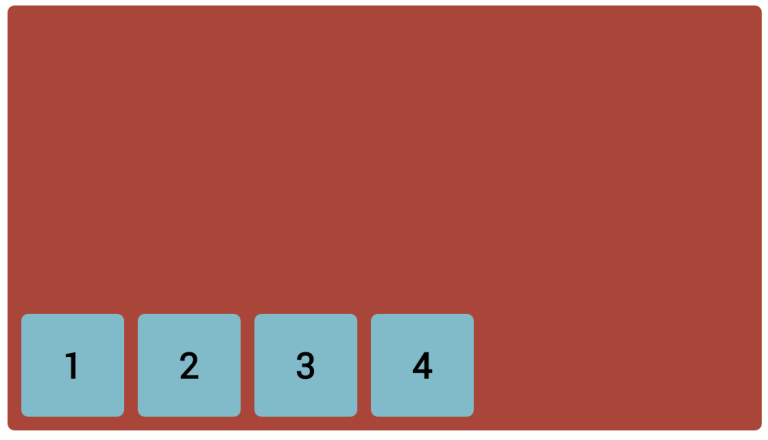
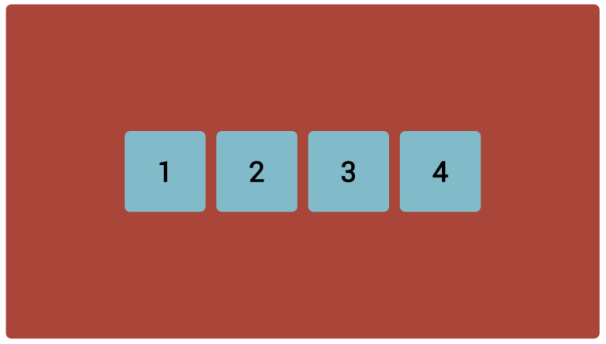
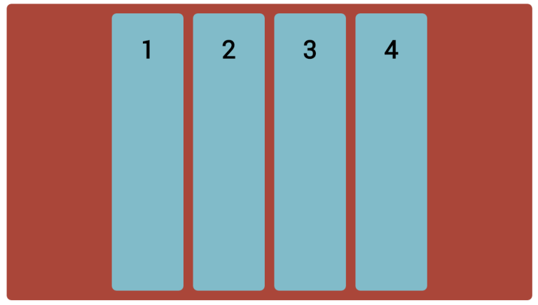

CHALLENGE
=========

 

-   Continuing from you previous code, change the box width to 150px and try
    replicate the following layouts:

 

 

-   Now change the container height to 600px; and try to replicate the following
    layouts:

 

