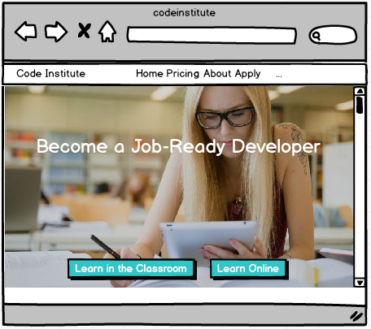

CHALLENGE
=========

 

NOTE: These challenges consist of using the Balsamiq software program, the
solutions below are present in the solutions folder, I have also added the
solutions for previous lessons in this folder for viewing purposes although they
didn’t consist of challenges.

 

**Challenge A:**

Taking what you have learned in this lesson, can you generate a Mockup similar
to the one shown below? This image is taken from the Code Institute home web
page.

 

The home page may have a new background image to the one you see here. Please
use the current image in your wireframe.

 

**Challenge B:**

Choose a popular app, such as a:

-   Bank app

-   Transport App

Create 3 to 4 screens, which will complete a particular task in the application.
