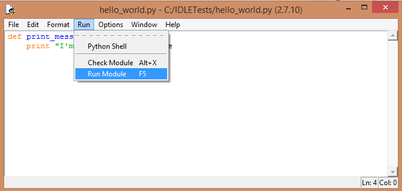
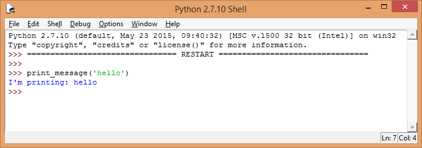
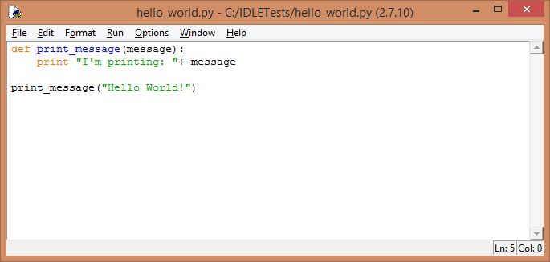
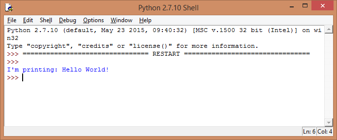

LESSON WALK THROUGH
===================

 

### RUNNING IDLE

IDLE is a basic text editor which gets installed as part of the Python package.
You can launch it by opening the Start menu and typing idle, then clicking on
the entry which appears. You also can locate it in the*Applications *directory
on a MAC or Linux.

 

### ADD SOME CODE

This is exactly the same as when we typed python into the command line earlier.

 

Now create a new file by going to file \> new file, then type in
the `print_message `function from earlier on.

 

It should now look like this:

 

Notice that it’s now syntax highlighted, which makes the text easier to read. To
run the program, we’ll have to save it first – so click file \> save and save
it. It is a good practice to create specific folders for your files. Go ahead
and do that as part of the save, but don’t save your work in the Python install
directory – things could get messy where you might accidentally override or
delete core python files.

 

*Python files are saved using the .py extension.*

 

### RUN YOUR CODE

We can run it by clicking run \> run module or pressing F5.

 

Because all we’ve done is defining a function, there won’t be any output.
However, running the module will open up a shell where our function can now be
called.

 

Now that the file is saved, we can load it up at a later date and don’t have to
type everything in again. We could even import this program from another file.

 

### BE LAZY

You’ll notice that in order to call the `print_message` function, we still have
to type the invocation inside the shell. Remember, good programming is lazy
programming, so let’s make things a little easier for ourselves by having the
code that calls `print_message` saved in the same file as the function.

 

Hit the F5 key to run your code.

 

CHALLENGE
=========

 

-   Open up `IDLE` and create a new file. Save it as `vacation.py`.

-   Add the code below to the file – you’ll remember it from Code Academy.

-   What’s missing in the code is the call to one of the functions that runs the
    whole program. Add that function call and pass in the expected function
    arguments. Remember, if passing a string as an argument, you must use single
    or double quotes around the text.

-   Once you have the code in place, save and hit F5 to watch your code run in
    all its glory.

~~~~~~~~~~~~~~~~~~~~~~~~~~~~~~~~~~~~~~~~~~~~~~~~~~~~~~~~~~~~~~~~~~~~~~~~~~~~~~~~
def hotel_cost(nights):
    return 140 * nights
 
def plane_ride_cost(city):
    if city == "Charlotte":
        return 183
    elif city == "Tampa":
        return 220
    elif city == "Pittsburgh":
        return 222
    elif city == "Los Angeles":
        return 475
 
def rental_car_cost(days):
    total_car = days * 40
    if days >= 7:
       total_car -= 50
    elif days >= 3:
        total_car -= 20
    return total_car
 
def trip_cost(city, days):
    return rental_car_cost(days) + plane_ride_cost(city) + hotel_cost(days)
 
# invoke function here
~~~~~~~~~~~~~~~~~~~~~~~~~~~~~~~~~~~~~~~~~~~~~~~~~~~~~~~~~~~~~~~~~~~~~~~~~~~~~~~~
