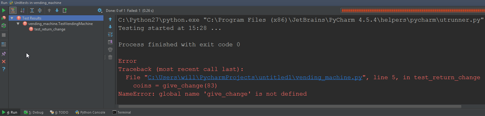

NO CHALLENGE
============

 

This lesson didn’t contain a challenge. However, it did contain a walk through.
I will post the walk through below allowing you to see what we had to do. Please
note the code (which can be viewed in the lesson solution folder) purposely
doesn’t work due to the nature of the lesson.

 

Lesson Walk Through
===================

 

### TEST-DRIVEN DEVELOPMENT

Test-driven Development (TDD) is a form of unit testing where the tests are
actually written before writing the program. This may seem counter-intuitive,
but it can actually be helpful to give you an idea of how to structure your
program.

In this unit, we’re going to write a simple program to control a vending machine
which supplies items and gives change as coins in GBP denominations. So for
example, if I insert £1 into the machine and buy an item that costs 83p, it will
return 17p in change as 10p + 5p + 2p.

We’ll start by writing a test for the change return function, which is the main
part of the program. Tests are usually kept in a separate file from the program
they are testing. Create a new file in the project you created in the last unit
called test\_vending\_machine.py and type in the following code:

~~~~~~~~~~~~~~~~~~~~~~~~~~~~~~~~~~~~~~~~~~~~~~~~~~~~~~~~~~~~~~~~~~~~~~~~~~~~~~~~
import unittest
 
class TestVendingMachine(unittest.TestCase):
    def test_return_change(self):
        coins = give_change(17)
        self.assertEqual(coins, [10, 5, 2], 'wrong change given')
~~~~~~~~~~~~~~~~~~~~~~~~~~~~~~~~~~~~~~~~~~~~~~~~~~~~~~~~~~~~~~~~~~~~~~~~~~~~~~~~

 

**Line 1:** We import the `unittest` module, which is the unit-testing module
that ships with Python. There are third-party unit-testing modules, such as
nose.py which add other features, but unittest should suffice for now.

**Line 3:** We define a class which inherits from unittest.TestCase. This is
necessary for the Python test runner to actually find our tests. A class can be
thought of as a collection of tests, perhaps with similar functionality.

**Line 4:** We define a method on the TestVendingMachine class which will house
our test code. The method name must begin with `test_;` otherwise the test won’t
run. As with writing normal program code, it’s important to use a descriptive
method name.

**Line 5: **We’re imagining that there’s a function called `give_change` which
returns a list of coins, given an amount in pence.

**Line 6: **Because we inherited from unittest.TestCase, we have some useful
methods that we can use, such as`assertEqual`, `assertTrue`,
or `assertFalse`. The first two parameters are the two values which we want to
assert as equal; the last parameter is an optional message which will be
displayed if the test fails. So what we’re saying is, ‘if I
call `give_change` with the number 17 and it returns [10, 5, 2], then the test
has passed; otherwise it has failed.’

PyCharm will automatically flag up an error because the give\_change function
hasn’t been written yet, but let’s run the test anyway. Press ctrl + shift +
f10 to run the unit tests in* test\_vending\_machine.py*:

 

The tests are shown as a tree structure, and we can see from the red exclamation
icons that our test has failed, and therefore our test class has failed too.

In other words, the whole thing has failed, which was an expected outcome as we
don’t have an actual program yet!

 

 
