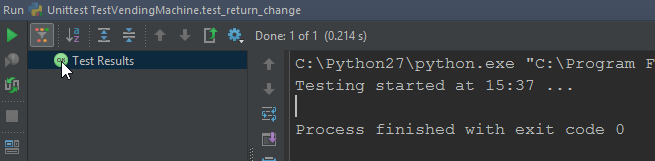

Lesson Walk Through
===================

 

### DO THE SIMPLEST THING THAT WORKS

One of the benefits of TDD is that it gives you a structure and makes it obvious
what we have to do next. We simply have to make the `return_change` function
pass.

So let’s just cheat. We know what the test is expecting, so let’s just return
that. Create a new file called vending\_machine.py and add the following
function:

~~~~~~~~~~~~~~~~~~~~~~~~~~~~~~~~~~~~~~~~~~~~~~~~~~~~~~~~~~~~~~~~~~~~~~~~~~~~~~~~
def give_change(amount):
    return [10, 5, 2]
~~~~~~~~~~~~~~~~~~~~~~~~~~~~~~~~~~~~~~~~~~~~~~~~~~~~~~~~~~~~~~~~~~~~~~~~~~~~~~~~

 

Make sure that this function is imported in test\_vending\_machine. Now, when we
run the test using ctrl + shift +F10, we can see that it passes:

 

Here we can see one of the problems with white-box testing; if you know what
test is going to be run, your program will be biased, and conversely if you know
how the program works, your tests will be biased.

 

It is for this reason that some people suggest that the team writing the tests
should not be the same as the team writing the program itself.

We’re now going to do something else that’s counter-intuitive; try to write a
test that fails. This is actually quite a common task when practising TDD.

A bug report will come in from your application’s users, and it’s important to
confirm that it really is a bug by writing a failing test. You then modify the
program code so that the test passes, and in doing so you increase the coverage
of the test suite.

Modify the test class as follows:

~~~~~~~~~~~~~~~~~~~~~~~~~~~~~~~~~~~~~~~~~~~~~~~~~~~~~~~~~~~~~~~~~~~~~~~~~~~~~~~~
class TestVendingMachine(unittest.TestCase):
    def test_return_change(self):
        self.assertEqual(give_change(17), [10, 5, 2], 'wrong change given')
        self.assertEqual(give_change(18), [10, 5, 2, 1], 'wrong change given')
~~~~~~~~~~~~~~~~~~~~~~~~~~~~~~~~~~~~~~~~~~~~~~~~~~~~~~~~~~~~~~~~~~~~~~~~~~~~~~~~

 

We’ve just added another test case – we expect 10p, 5p, 2p, and 1p to make up
18p.

We can see this error when we run the test now:

 

Challenge Solution
==================

 

-   Try and write the correct code for `give_change` to work.

Let’s try this new version out:

~~~~~~~~~~~~~~~~~~~~~~~~~~~~~~~~~~~~~~~~~~~~~~~~~~~~~~~~~~~~~~~~~~~~~~~~~~~~~~~~
coins = [100, 50, 20, 10, 5, 2, 1]
 
 
def give_change(amount):
    change = []
    for coin in coins:
        if coin <= amount:
            amount -= coin
            change.append(coin)
    return change
~~~~~~~~~~~~~~~~~~~~~~~~~~~~~~~~~~~~~~~~~~~~~~~~~~~~~~~~~~~~~~~~~~~~~~~~~~~~~~~~

 

**Line 1:** We define our list of coins in pence.

**Line 5:** We define an empty list which will hold our list of coins.

**Lines 6-8: **We iterate through the coins, seeing if the coin is less than or
equal to the amount. If it is, we take off the value of the coin and add it to
the list. Remember that `amount -= coin` is just shorthand for`amount = amount -
coin`. We skip £1, 50p and 20p because they’re too large, but when it comes to
10p, we take it off (and add it to the list) so we’re left with amount =17-10 =
7p, and change = [10]. We then take off 5p and 2p so that amount = 0 and change
= [10,5,2], which is the right answer.

We can see that the tests pass, but there’s still a bug. Can you spot it? Each
coin is only ever used once, so we just have to think of an amount that requires
two or more of the same coin, for instance 4p. Add the following test method to
the test class:

~~~~~~~~~~~~~~~~~~~~~~~~~~~~~~~~~~~~~~~~~~~~~~~~~~~~~~~~~~~~~~~~~~~~~~~~~~~~~~~~
def test_multiple_same_coins(self):
    self.assertEqual(give_change(4), [2, 2])
~~~~~~~~~~~~~~~~~~~~~~~~~~~~~~~~~~~~~~~~~~~~~~~~~~~~~~~~~~~~~~~~~~~~~~~~~~~~~~~~

 

Notice that this time we didn’t supply a message to assertEqual, so we get
slightly different output, telling us how the lists differ. Sometimes it’s
actually better not to supply a message, as the output can be quite helpful:

~~~~~~~~~~~~~~~~~~~~~~~~~~~~~~~~~~~~~~~~~~~~~~~~~~~~~~~~~~~~~~~~~~~~~~~~~~~~~~~~
Failure
Traceback (most recent call last):
  File "C:\Users\will\PycharmProjects\untitled1\vending_machine.py", line 19, in 
test_return_change
    self.assertEqual(give_change(4), [2, 2])
AssertionError: Lists differ: [2, 1] != [2, 2]
 
First differing element 1:
1
2
 
- [2, 1]
?     ^
 
+ [2, 2]
?     ^
~~~~~~~~~~~~~~~~~~~~~~~~~~~~~~~~~~~~~~~~~~~~~~~~~~~~~~~~~~~~~~~~~~~~~~~~~~~~~~~~

 

If the new test isn’t running, make sure you’re running the test class rather
than the test method in the Run/Debug configuration:

 

 
