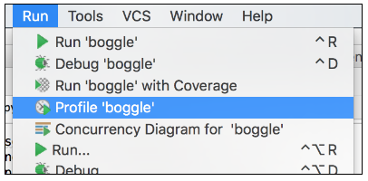

Profiling
=========

 

Pycharm provides a ‘profiler’ that allows you to run a program and then view a
report of how much time it spent in each of it’s functions. Before engaging in
any optimisation effort, it’s vital to know where the time is actually being
lost.

 

Set the Boggle grid size to 3×3. Then execute Boggle with the profiler, on the
Run menu.

 

 

The program will run as normal, but it will also save the results of profiling
the code to a file.

 

 

Copy the path of the **.pstat** file, and then open the file using the ‘**Open
CProfile snapshot**’ on the Pycharm Tools menu.

 

 

Pycharm displays profiling results in a grid. Sort by **Time descending**.

 

 

Boggle.py and main obviously represent 100% of the time, since they are the top
level of our program. The
search [function](http://codeinstitute.wpengine.com/glossary/function/) is
clearly where we are spending nearly all of the time, which is as we’d expect.

 

More specifically, we spend our time in
the **do\_search** [function](http://codeinstitute.wpengine.com/glossary/function/),
which is the recursive
inner [function](http://codeinstitute.wpengine.com/glossary/function/). Again,
nothing too surprising here.

 

Let’s take a closer look at
that [function](http://codeinstitute.wpengine.com/glossary/function/):

~~~~~~~~~~~~~~~~~~~~~~~~~~~~~~~~~~~~~~~~~~~~~~~~~~~~~~~~~~~~~~~~~~~~~~~~~~~~~~~~
def do_search(path):
        word = path_to_word(grid, path)
        if word in dictionary:
            paths.append(path)
        for next_pos in neighbours[path[-1]]:
            if next_pos not in path:
                do_search(path + [next_pos])
~~~~~~~~~~~~~~~~~~~~~~~~~~~~~~~~~~~~~~~~~~~~~~~~~~~~~~~~~~~~~~~~~~~~~~~~~~~~~~~~

 

The **do\_search** [function](http://codeinstitute.wpengine.com/glossary/function/) calls **path\_to\_word**,
but we know that isn’t the problem because it’s shown in the profile data as
accounting for only about 0.1% of the running time of the algorithm.

 

The other two candidates are the check for whether a word is in a dictionary, or
checking whether certain positions are neighbours of other positions.

 

Neither of them are shown directly in the profiling data, because they aren’t in
their own [function](http://codeinstitute.wpengine.com/glossary/function/).
Recall that in the last module we discussed the benefits of creating programs
from small single purpose functions. Yet another benefit is that doing so makes
profiling more granular.

 

The dictionary is the most interesting place to start since we could be dealing
with hundreds of thousands of words. We can get the dictionary lookup to appear
in our profiling data by extracting it into it’s
own [function](http://codeinstitute.wpengine.com/glossary/function/).

~~~~~~~~~~~~~~~~~~~~~~~~~~~~~~~~~~~~~~~~~~~~~~~~~~~~~~~~~~~~~~~~~~~~~~~~~~~~~~~~
def is_a_real_word(word, dictionary):
    return word in dictionary
 
def search(grid, dictionary):
    neighbours = all_grid_neighbours(grid)
    paths = []
 
    def do_search(path):
        word = path_to_word(grid, path)
        if is_a_real_word(word, dictionary):
            paths.append(path)
...
...
~~~~~~~~~~~~~~~~~~~~~~~~~~~~~~~~~~~~~~~~~~~~~~~~~~~~~~~~~~~~~~~~~~~~~~~~~~~~~~~~

 

Create a
new [function](http://codeinstitute.wpengine.com/glossary/function/), **is\_a\_real\_word**,
and call it from within **do\_search**. Let’s see what that does to the profile.

 

 

And there you have it. Our algorithm spends nearly all of it’s time searching
for a word in the dictionary. We are basically losing no time on our own code
with its recursive searching, and the data structures we use to represent grids,
paths, and words.

 

The time is actually being lost in Python’s own code for checking if a word is
in a list. Lists are searched sequentially from first to last, so every word
that is not in the dictionary will cause the entire list to be iterated over,
just to decide that that word isn’t in it. Every single one.

 

This is a very wasteful way of searching, particularly when you realise how many
potential words we encounter (remember the quadratic growth we saw earlier).
Each of the trillions of combinations of letters causes the entire dictionary to
be searched.
