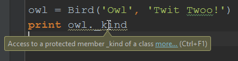

THE BIRD CLASS
==============

 

A class can be thought of as a ‘blueprint’ from which class instances can be
made. Consider this very simple class, which models a Bird that has a call:

~~~~~~~~~~~~~~~~~~~~~~~~~~~~~~~~~~~~~~~~~~~~~~~~~~~~~~~~~~~~~~~~~~~~~~~~~~~~~~~~
class Bird:
    def __init__(self, kind, call):
        self.kind = kind
        self.call = call
 
    def do_call(self):
        print 'a %s goes %s' % (self.kind, self.call)
~~~~~~~~~~~~~~~~~~~~~~~~~~~~~~~~~~~~~~~~~~~~~~~~~~~~~~~~~~~~~~~~~~~~~~~~~~~~~~~~

 

**Line 1:** We define a class by using the class keyword followed by the name.

 

**Lines 2-4:** We define the initializer, which is the code that will be run
when an instance of the class is created. Here we’re saving the type of bird and
the call it makes to self, the instance of the class. It’s customary to use
self to refer to the class instance, but in fact any variable could be used.

 

**Lines 6-7:** The do\_call method prints a string using the kind and
call variables saved to the class previously.

 

The **\_\_init\_\_ method** is known as a dunder, double-underscore, or magic
method, and these tend to mainly be used on classes. They use double underscores
so as not to conflict with your own defined classes.

 

You can make methods and variables private to a class or module by appending a
single underscore. For instance, imagine there was an internal method that
needed to be called before calling **do\_call**, called **pre\_do\_call**. We
could make this method private by renaming it to **\_pre\_do\_call**. There’s
actually nothing stopping you calling a private method such
as **\_pre\_do\_call**, but it tells other developers that this is a private
method and therefore shouldn’t be called from outside the class. The same
applies to private variables.

 

It’s better to expose as little of your class to the outside world as possible,
because once internals of the class are exposed to and used by other parts of
your program, it becomes very difficult to change them. This is known
as [encapsulation](http://codeinstitute.wpengine.com/glossary/encapsulation/) –
see <https://en.wikipedia.org/wiki/Encapsulation_(computer_programming)>

 

Create a new file with the above code in, select it and press **alt + shift +
e** to run it in the Python console. Try initialising it with different values:

~~~~~~~~~~~~~~~~~~~~~~~~~~~~~~~~~~~~~~~~~~~~~~~~~~~~~~~~~~~~~~~~~~~~~~~~~~~~~~~~
>>> class Bird:
    def __init__(self, kind, call):
        self.kind = kind
        self.call = call
    def do_call(self):
        print 'a %s goes %s' % (self.kind, self.call)
 
>>> bird = Bird()
Traceback (most recent call last):
  File "<input>", line 1, in <module>
TypeError: __init__() takes exactly 3 arguments (1 given)
>>> owl = Bird('Owl', 'Twit Twoo!')
>>> owl.do_call()
a Owl goes Twit Twoo!
>>> crow = Bird('Crow', 'Caaaw!')
>>> crow.do_call()
a Crow goes Caaaw!
>>> crow.call
'Caaaw!'
~~~~~~~~~~~~~~~~~~~~~~~~~~~~~~~~~~~~~~~~~~~~~~~~~~~~~~~~~~~~~~~~~~~~~~~~~~~~~~~~

 

**Lines 1-6:** This is the **Bird** class being run in the console

 

**Line 8:** We get an error here because we haven’t provided the two arguments
that are expected by** \_\_init\_\_**

 

**Lines 11-19:** We define two different instances of Bird and call
their **do\_call** method.

 

We could change the code so that kind and call are private:

~~~~~~~~~~~~~~~~~~~~~~~~~~~~~~~~~~~~~~~~~~~~~~~~~~~~~~~~~~~~~~~~~~~~~~~~~~~~~~~~
class Bird:
    def __init__(self, kind, call):
        self._kind = kind
        self._call = call
 
    def do_call(self):
        print 'a %s goes %s' % (self._kind, self._call)
 
 
owl = Bird('Owl', 'Twit Twoo!')
print owl._kind
~~~~~~~~~~~~~~~~~~~~~~~~~~~~~~~~~~~~~~~~~~~~~~~~~~~~~~~~~~~~~~~~~~~~~~~~~~~~~~~~

 

As you can see, **\_kind** is still accessible, but notice that we’re getting a
warning about accessing a private variable:

