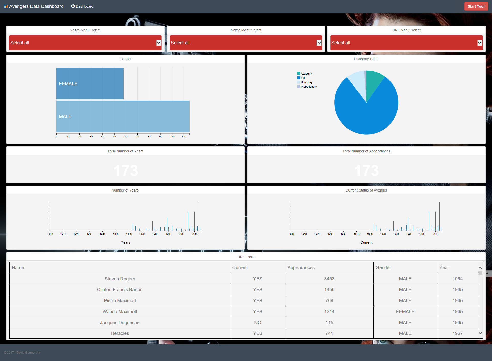

Stream 2 - Final Project
========================

Avengers Data Dashboard
-----------------------

Live version of the Avengers data dashboard is available for viewing on Heroku:
<https://boiling-everglades-31193.herokuapp.com/>

Here is a link for the data I used in my project - CSV Data source:
https://github.com/fivethirtyeight/data/tree/master/avengers

### **Table of Contents**

-   [Project Name](\#project-name)

-   [Description](\#description)

-   [Installation](\#installation)

-   [Usage](\#usage)

-   [Contributing](\#contributing)

-   [Credits](\#credits)

-   [Licence](\#license)

### **Project name**: 

Code Institute - Stream 2 Final Project. “Avengers Data Dashboard”

[Back to Table Of Contents](\#table-of-contents)

### **Description**: 

The Avengers data dashboard is just that. It is a dashboard to display different
types of Avengers information in the form of graphs, bar charts, pie charts,
table and more, using technologies such as Flask, DC.js, D3.js, Python, MongoDB
and more. If you would like to see the project brief for a full breakdown of
what I was instructed to do then please refer to the [Project
Brief](ProjectBrief.md) file.

[Back to Table Of Contents](\#table-of-contents)

### **Installation**: 

#### Running the MongoDB Server:

-   Firstly, you will need MongoDB installed [Download
    MongoDB](https://www.mongodb.com/download-center?jmp=nav\#community)

-   You should then simply be able to run this command in a terminal/cmd window

`'mongod --config [PATH]\_mongoDB_data\_config\_mongodb_config.conf'`

**NOTE:** You will need to ammend the path as neccessary to suit where you
extracted the file too.

#### Uploading the data for the database to work:

• Run mongoDB by running the command mongod in your Terminal/Command Prompt.

• Leave the prompt running as it is and open another Terminal/Command Prompt
window.

• Copy the csv file to the same location as the directory opened in the second
terminal window.

• Enter the following command:

`'mongoimport  -d avengers -c avengers_project --type csv --file avengers.csv
--headerline'`

• The database created: avengers

• The collection name: avengers_project

• The data type to be uploaded: csv

• The filename: \_csv_data\\avengers.csv

• Treat the first record imported as the field names: --headerline

**NOTE:** It will take a few minutes to upload the data. You will see a progress
indicator in the terminal letting you know how much data has approximately been
uploaded.

#### Running the requirements.txt to install needed packages:

For virtualenv to install all files in the requirements.txt file.

1.  cd to the directory where requirements.txt is located

2.  activate your virtualenv

3.  run: `pip install -r requirements.txt` in your shell

 

[Back to Table Of Contents](\#table-of-contents)

### **Usage**: 

The next section is usage, in which you instruct other people on how to use your
project after they’ve installed it. This would also be a good place to include
screenshots of your project in action.

[Back to Table Of Contents](\#table-of-contents)

### **Contributing**: 

Larger projects often have sections on contributing to their project, in which
contribution instructions are outlined. Sometimes, this is a separate file. If
you have specific contribution preferences, explain them so that other
developers know how to best contribute to your work. To learn more about how to
help others contribute, check out the guide for (setting guidelines for
repository
contributors)[https://help.github.com/articles/setting-guidelines-for-repository-contributors/].

[Back to Table Of Contents](\#table-of-contents)

### **Credits**: 

Include a section for credits in order to highlight and link to the authors of
your project.

[Back to Table Of Contents](\#table-of-contents)

### **License**: 

If you would like more information on choosing a license, check out
GitHub’s [licensing guide](http://choosealicense.com/)!

[Back to Table Of Contents](\#table-of-contents)

 
