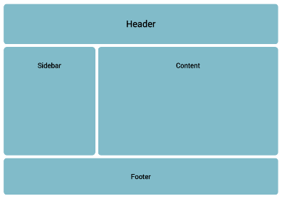

CHALLENGE
=========

 

Validate your code:

-   Go to: [https://validator.w3.org](https://validator.w3.org/)

-   Follow the instruction to validate your code.

-   You may get a number of errors, sometimes they can be quite cryptic. See if
    you can make any sense of them.

-    

*Extra Challenge:*
------------------

Create the following layouts using percentage (%) widths rather than pixels
(px):

