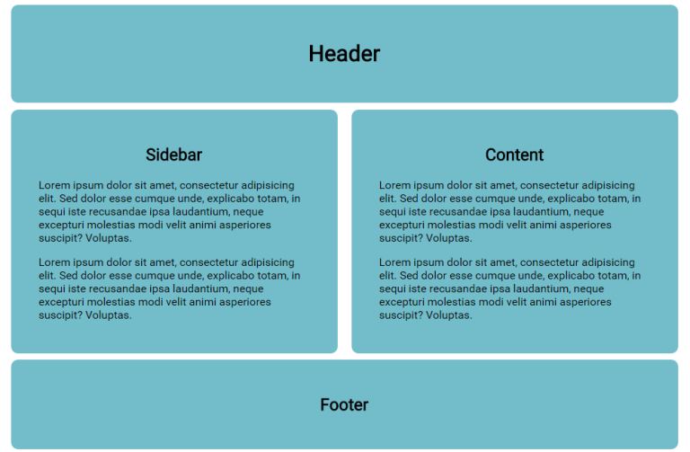
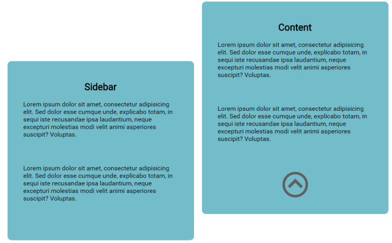

PRACTICE WITH ABSOLUTE POSITIONING
==================================

 

Continuing from the final challenge of the `border-box` in the previous lesson,
we are going to add a `link-to-top` image to the bottom right of the
content `div`.

 

-   Remove the `border`**s** and `left align` the paragraphs (optional).

-   Place the image (located in this lessons image folder) after the final
    paragraph **closing tag** in **content **`div`. If you are unsure of the
    syntax for the `img` tag, try: <http://www.w3schools.com/tags/tag_img.asp>

Give the image an `id` of `linkToTop` and we can give all paragraphs a bottom
`margin` of `50px` to make room for the image.

 

-   This is the most important step! Change the `position` of content
    to `relative` and `linkToTop` to `absolute`.

    Notice how the element is now removed from the normal flow of the page. Now
    we can offset it where we like in relation to the content `div`.

-   Place the `linkToTop` on the bottom right of content.

~~~~~~~~~~~~~~~~~~~~~~~~~~~~~~~~~~~~~~~~~~~~~~~~~~~~~~~~~~~~~~~~~~~~~~~~~~~~~~~~
bottom: 0px;
right: 0px; /*experiment with other values*/
~~~~~~~~~~~~~~~~~~~~~~~~~~~~~~~~~~~~~~~~~~~~~~~~~~~~~~~~~~~~~~~~~~~~~~~~~~~~~~~~

 

From here we can offset the image if we wish. This example shows the offset is
to the right with a minus value, which will place it outside the content box.

~~~~~~~~~~~~~~~~~~~~~~~~~~~~~~~~~~~~~~~~~~~~~~~~~~~~~~~~~~~~~~~~~~~~~~~~~~~~~~~~
right: -80px;
~~~~~~~~~~~~~~~~~~~~~~~~~~~~~~~~~~~~~~~~~~~~~~~~~~~~~~~~~~~~~~~~~~~~~~~~~~~~~~~~

 

-   For practice, add another element to the left of the sidebar. It should have
    its own `id` (`#sideLinkToTop`).

